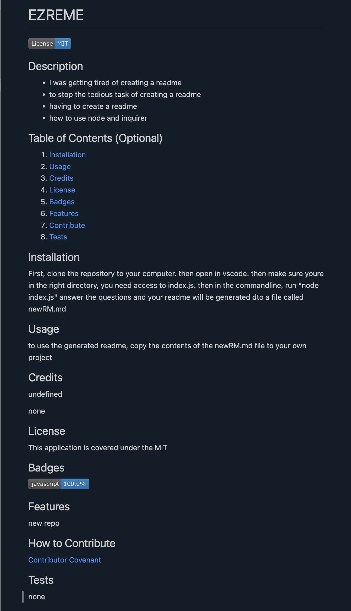

# EZREME

  
  ## Description
   
  - I was motivated to save time
  - I build this project because I spend a lot of time creating README.md files
  - The ammount of time I waste making README.md files
  - I learned hwo to use Node and inquirer
  
## Table of Contents (Optional)
  
  1. [Installation](#installation)
  2. [Usage](#usage)
  3. [Credits](#credits)
 1. [License](#License)
  4. [Badges](#badges)
  5. [Features](#features)
  6. [Contribute](#contribute)
  7. [Tests](#tests)

  

## Installation

to install this application clone the repo, and install the dependencies
  
## Usage
  
to use this application navigate to the folder in this repo containing index.js in your terminal. enter node index.js then answer the prompts. copy the contents or newRM.md and paste them where you wish
  
## Credits
  
undefined
  
none

## License

This application is covered under the MIT
   
## Badges
  

    
## Features
  
this application features a readme generator
  
## How to Contribute
  
[Contributor Covenant](https://www.contributor-covenant.org/)

## Tests
  
